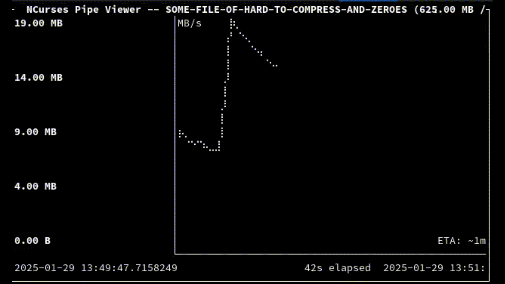

# ncpv

`ncpv` is a program to monitor the progress of data through a pipeline.
It is a simple, fast, and user-friendly alternative to [`pv`](https://www.ivarch.com/programs/pv.shtml).
While it does not aim to support all of `pv`'s powerful functionality, it provides sensible
(opinionated) defaults for a majority of use cases.

## Features

* Helps in visualizing the progress of data through a pipeline.
* Gives a visual representation of slowdowns and bottlenecks over time, unlike `pv`.
* Intuitive syntax: `ncpv` instead of `pv`.
* Real-time progress monitoring with ncurses interface.
* Displays transfer rate, ETA, and percentage complete.
* Supports rate limiting and buffer size configuration.

## Demo




## How to use

First, to get an overview of all available command line options, you can either run
`ncpv -h` for a concise help message or `ncpv --help` for a more detailed version.

### Simple usage

`ncpv` is designed to monitor the progress of data through a pipeline. The most basic usage is to
run `ncpv` with a single argument: the file path. For example, to monitor the progress of copying a file:
``` bash
$ ncpv source.txt > destination.txt
```
